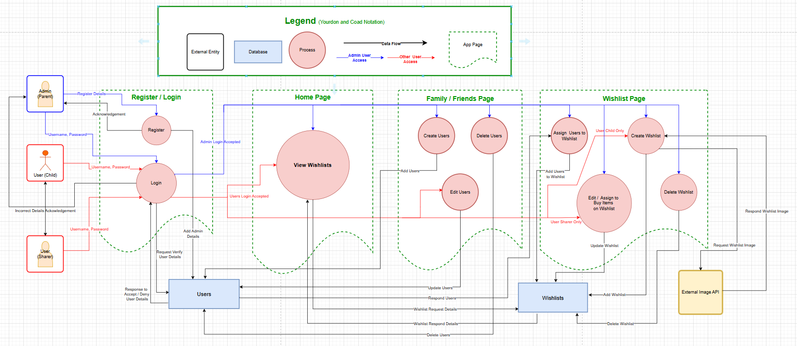

# R2 - PresentPals Dataflow Diagram

# Details
## Register / Login Data
### Admin Users Data:
When a user registers to access the PresentPals application they will become a administrator user by entering the following data:

    - group name,
    - user name,
    - password.

This data will be added to the Users collection in the database creating all the following data fields:

    - groupId [Int, unique],
    - groupname [String, unique],
    - userId [Int, unique],
    - username [String, unique],
    - password [String, hashed].
    - isAdmin [Boolean] (true = administrator).

When a admin user logs into the application their credentials will have access to:

    - Create other users usernames & passwords to log into the application.
    - Delete users.

- Have access to all processes / functions in the application:
    - View the created wishlist(s),
    - Create a wishlist(s),
    - Delete a wishlist(s),
    - Assign users to a wishlist(s),
    - Edit / Assign to buy a item(s) on a wishlist(s),

### Other Users Data:
Upon logging in with a username & password , this will be requested for validation in the Users collection of the database and responded to accept for access, or deny & acknowledged as incorrect details.

The accepted credentials will allow acces to the following:

- User (Child): 
    - Create a wishlist(s),
    - View the created wishlist(s),
    - Edit their profile details.
- Users (Sharer):
    - View the created wishlist(s),
    - Edit / Assign to buy a item(s) on a wishlist(s).

## Home Page Data
This home page is where logged in users can view the wishlists they have been assigned to view.
Once the user selects the wishlist they choose to view, the component will send a request to the wishlists collection in the applications database. The data response from the wishlists collection will be received by the component and rendered in the users browser to view all the details in the wishlist chosen. The Wishlists collection data fields to be responded will be:

    - wishlistName [String],
    - wishlistImage [Image],
    - childUser [String] (child that created wishlist),
    - childItem [String] (added to wishlist by child user),
    - itemPurchased [Boolean] (item marked as purchased by an assigned sharer.Note: child user blocked from viewing this area).
    - purchasedUser [String] (assigned sharer that marked itemPurchased.Note: child user blocked from viewing this area).
    - dateCreated [Date] (date wishlist was created),
    - dateExpired [Date] (rendered as a countdown of days to expiry date!).

## Family & Friends Page Data
The applications area for creating, editing & deleting users profiles will be on this page.
Create users function will add the following data to the Users collection in the database:

    - groupId [Int] (same as currently logged in),
    - userId [Int, unique],
    - username [String, unique],
    - password [String, hashed],
    - firstname [String],
    - lastname [String],
    - email [String],
    - phonenumber [String].

Edit users function will update all of the above data fields.
Delete users function will delete all the above data fields.

## Wishlist Page Data
This page is where application wishlists will be created, edited, deleted, have users assigned and sharer users assigned to purchase items.
The following data fields will be applied to the Wishlists collection in the database from the create wishlist function:

    - wishlistId [Int, unique],
    - wishlistName [String],
    - wishlistImage [Image] (From the external image API),
    - childUser [String] (child that created wishlist),
    - childItem [String] (Item(s) added to wishlist by child user),
    - dateCreated [Date] (date wishlist was created),
    - dateExpired [Date] (date this wishlist will expire).

The following data fields will be applied to assigned wishlistId in the Wishlists collection from the assigned users to wishlist function:

    - assignedUsers [Array],

The following data fields will be applied to the assigned wishlistId in the Wishlists collection from the edit/assign to buy items on wishlist function:

    - itemPurchased [Boolean] (item marked as purchased by an assigned sharer.),
    - purchasedUser [String] (assigned sharer that marked itemPurchased).

The delete wishlist function will delete all these data fields for the selected wishlistId.

.................................................................................................................................................

