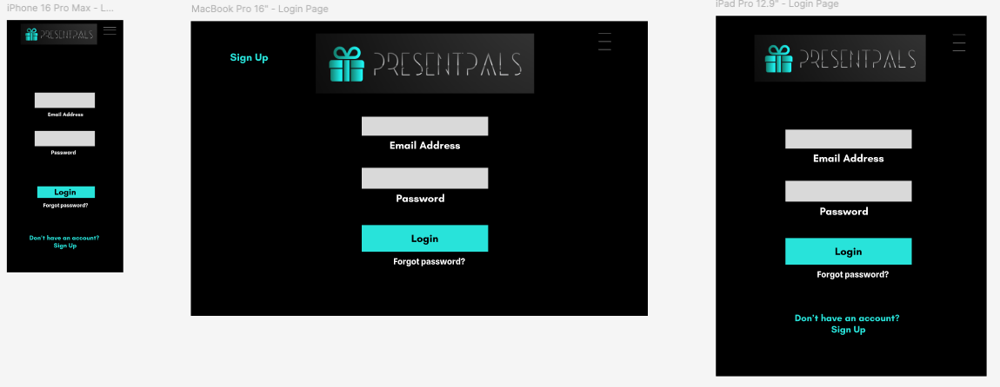
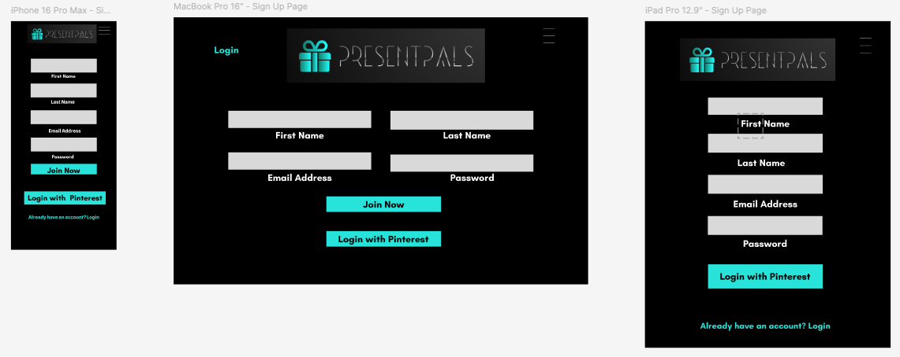
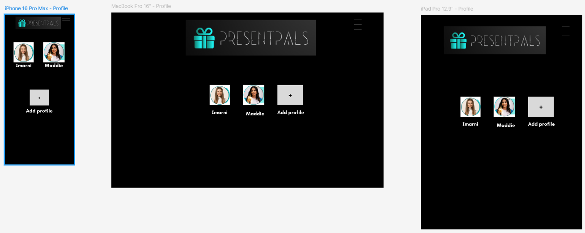
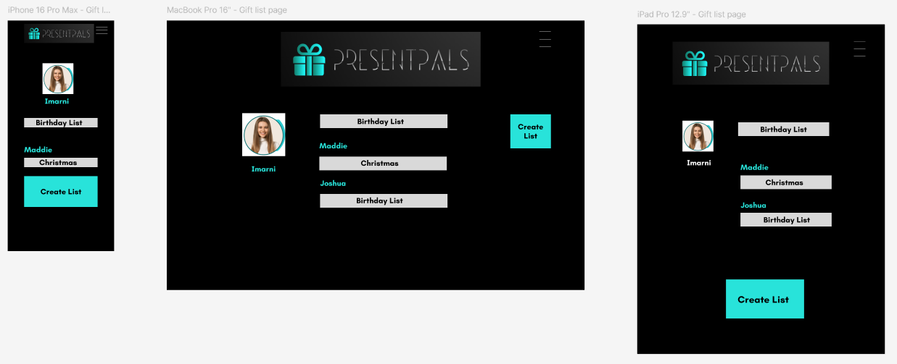
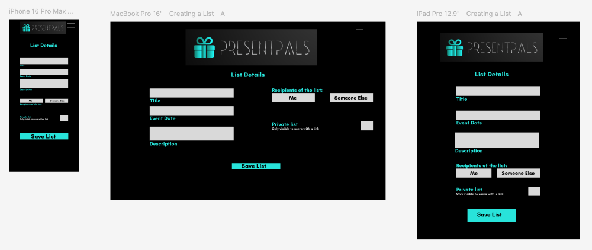
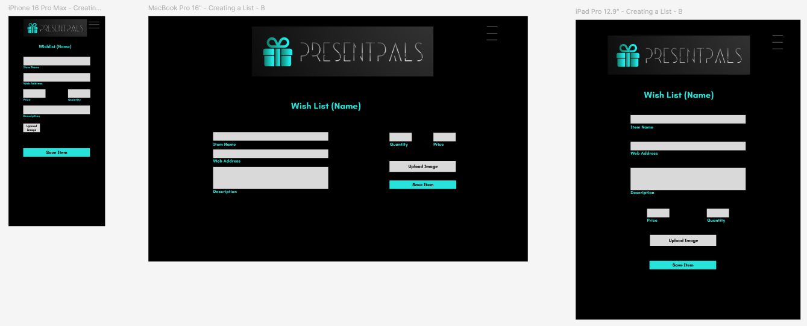
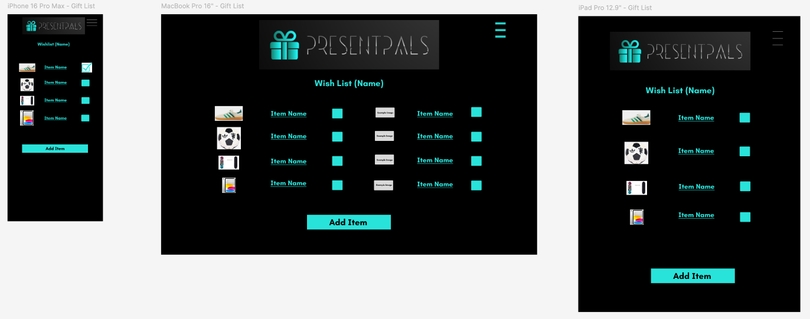
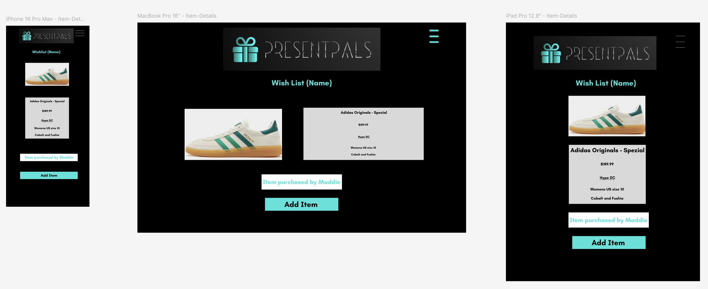

# T3A2 Part A Documentation
# PresentPals
# R5. Wireframes

The wireframes can be viewed in the [PresentPals](https://www.figma.com/design/vPTSsXFEPWThJec5qK5Bo5/PresentPals?node-id=0-1&t=GZfS7PRp5mvqkPUg-1) Figma workspace.

### Colour Palette

For this design we have selected the following colours which matches our font selection of Teacher (Bold). The text is both highly legible and visually engaging.

Provided is a breakdown of our wireframes on the following devices: 
* iPhone 16 Pro Max
* MacBook Pro 16"
* iPad Pro 12.9"

### Login Page
A commonly used version of the Login Page

### Sign Up Page

A generalised sign up page, that is fairly common with most websites.

### Profile Page

The example provided for the profile page, is for a family, Parent (is the admin) and the child has a profile. We decided to create a family account (like Netflix, Stan, Disney+) as most children will not have an email or social media account, required to login

### Giftlist Page

In this example we have provided the following:
* iPhone: Parent, with child (Maddie) list
* iPad and MacBook: Have provided an admin profile that has a child (Maddie) and a shared list (Joshua).

The lists that are shared will be accessible via this page. Each list will be public for a certain amount of time, afterwards they will be archived.

### Create a List

The steps to create a wishlist are details across the following pages:

Page A

Page B

### Itemised List

A view of the items on the gift list

### Item Details

Provide a breakdown of the item on the list, with an image, item name, pricing, link to the website (where the item can be purchased), and then additional notes (eg sizing, colour preference).

