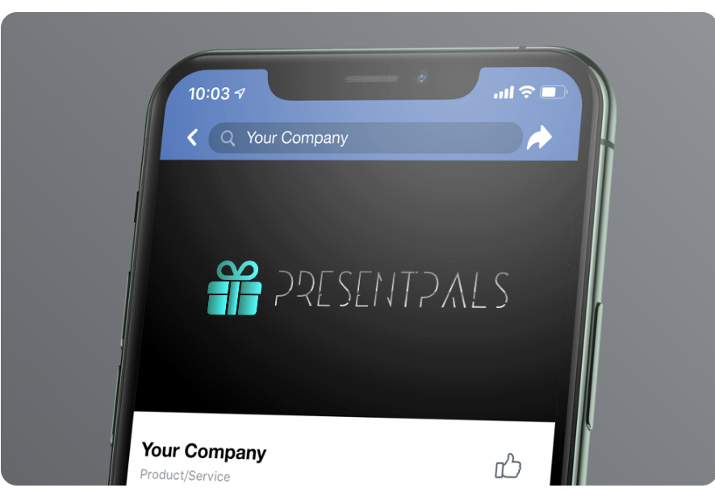

# T3A2 Part A Documentation
# PresentPals
# R5. Wireframes

The wireframes can be viewed in the [PresentPals](https://www.figma.com/design/vPTSsXFEPWThJec5qK5Bo5/PresentPals?node-id=0-1&t=GZfS7PRp5mvqkPUg-1) Figma workspace.

### Colour Palette

For the design, our main objective was to evoke a sense of tranquility and warmth, something that would resonate with both young and older generations, while maintaining an air of sophistication. We selected the timeless Tiffany blue to establish a serene and refined atmosphere of quality, enhancing the space with a sense of understated elegance. To further elevate the overall aesthetic, we incorporated sleek black accents, which serve to complement and enrich the design. The logo itself features a signature Tiffany blue gift box, gracefully transitioning into a subtle silver gradient nameplate, while the deep black background offers a striking yet refined contrast, adding to its depth and an elevated sense of luxury to the composition.

### Typography
For the typography, we placed a strong emphasis on readability while maintaining an elevated aesthetic. For the body text, we selected a clean, modern sans-serif font, chosen specifically for its clarity and legibility, ensuring a smooth reading experience across digital platforms. This choice promotes ease of comprehension while contributing to a sleek, contemporary look. For the headings, we opted for a refined, elegant serif font that not only commands attention but also exudes sophistication and grace. The contrast between the simplicity of the body text and the elevated nature of the headings creates a harmonious visual rhythm, striking a perfect balance between functional design and timeless elegance.

The logo features a distinctive custom-designed font that immediately captures attention, exuding a sense of boldness and individuality. Its striking appearance is enhanced by a sophisticated silver chrome finish, which imparts a luxurious, metallic sheen. This polished effect not only elevates the overall visual impact but also adds depth and richness to the font, reinforcing the logo's premium, high-end appeal. The combination of the unique typeface and the reflective metallic tone creates a dynamic and memorable mark that is both modern and refined.

Provided is a breakdown of our wireframes on the following devices: 
* iPhone 16 Pro Max
* MacBook Pro 16"
* iPad Pro 12.9"

### Login Page
A commonly used version of the Login Page

### Sign Up Page

A generalised sign up page, that is fairly common with most websites.

### Profile Page

The example provided for the profile page, is for a family, Parent (is the admin) and the child has a profile. We decided to create a family account (like Netflix, Stan, Disney+) as most children will not have an email or social media account, required to login

### Giftlist Page

In this example we have provided the following:
* iPhone: Parent, with child (Maddie) list
* iPad and MacBook: Have provided an admin profile that has a child (Maddie) and a shared list (Joshua).

The lists that are shared will be accessible via this page. Each list will be public for a certain amount of time, afterwards they will be archived.

### Create a List

The steps to create a wishlist are details across the following pages:

Page A

Page B

### Itemised List

A view of the items on the gift list

### Item Details

Provide a breakdown of the item on the list, with an image, item name, pricing, link to the website (where the item can be purchased), and then additional notes (eg sizing, colour preference).

