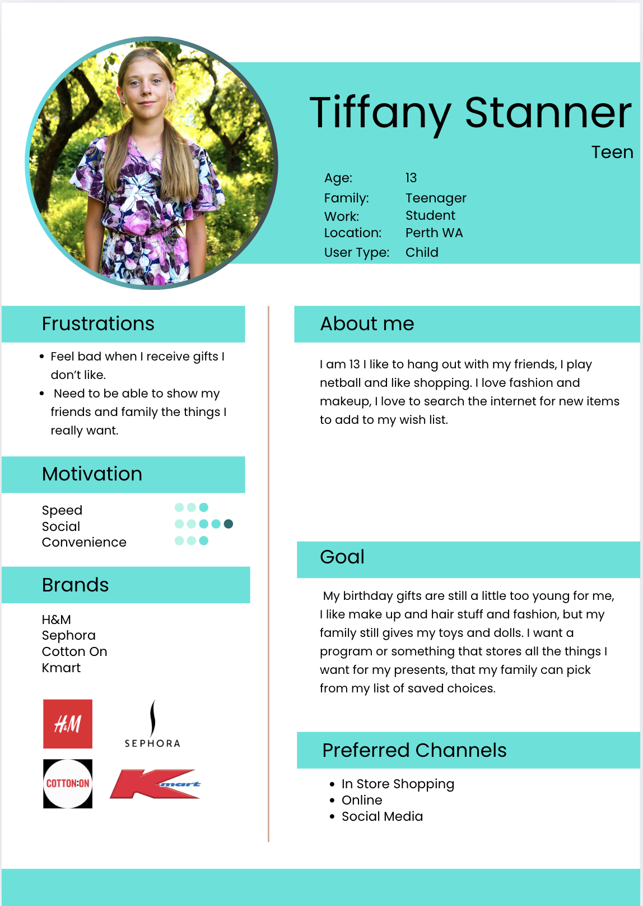
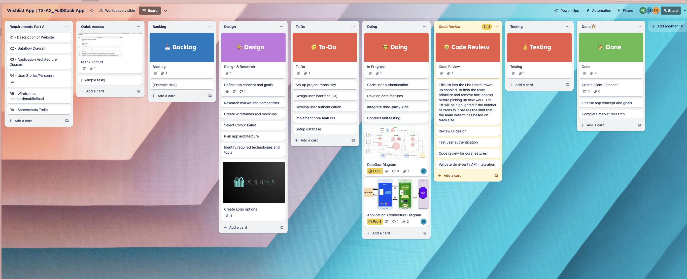
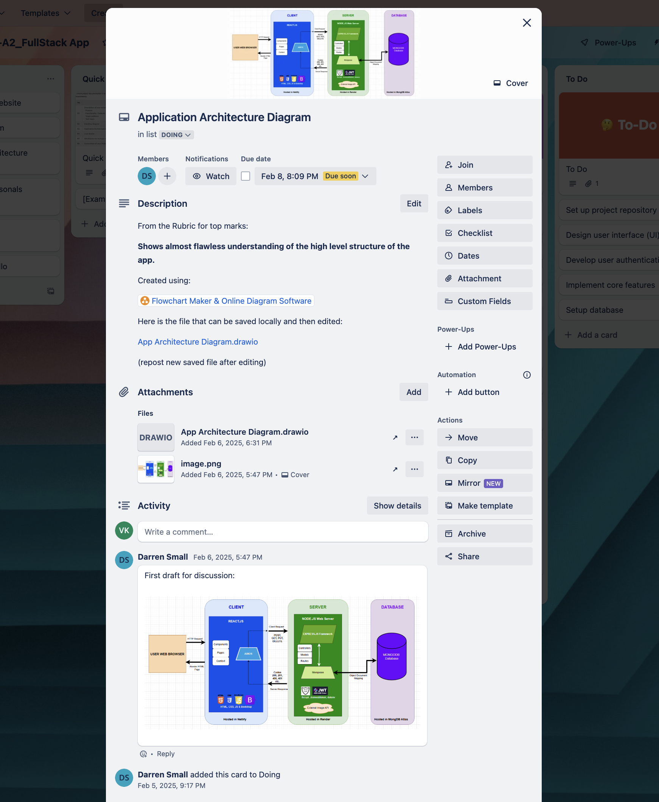

# T3A2 Part A Documentation

# R1 - PresentPals Description
---

# Purpose
Our customer's goal was to develop an application that is both meaningful and impactful, and we believe we've achieved the perfect balance. This initiative combines environmental sustainability with cost-efficiency and time-saving benefits, offering a solution that serves both the planet and the user. We focused on four key objectives: protecting the environment, minimizing wasteful spending on unwanted gifts, simplifying the gift-giving process, and saving time. Our aim was to create an experience that’s not only useful but also intuitive and enjoyable for all users.

## Functionalities/Features
 - Gift List
 - Customised profiles
 - Birthday or Event countdown
 - Invite Friends and Family
 - Shop by Brands - with Links to Popular Brands' websites

 ## Target Audience
The platform was primarily designed with families in mind—particularly parents, grandparents, and other family members who want to make gift-giving easier and more meaningful. However, it’s also beneficial for groups beyond just families.

Parents and grandparents can create accounts, set up customized profiles for their children (ages 8-17), and start building personalised Wishlists. Once a wishlist is ready, the admin user (parent or grandparent) can easily share it with other family members, who can then purchase the perfect gift online directly through the provided links. It’s a simple, eco-friendly way to ensure the right gift is chosen, while saving time and reducing waste

## Key Objectives

**Environmental Impact:** 
By transitioning to a paperless system for gift lists, the platform helps significantly reduce paper waste. Traditional gift lists often require printing and can contribute to unnecessary consumption of paper, adding to landfill waste. By going digital, this system plays an active role in promoting environmental sustainability, minimising the carbon footprint associated with producing, distributing, and discarding paper-based gift lists. In this way, it supports a more eco-friendly approach to gift giving, encouraging users to be mindful of their environmental impact.

**Cost-Effective Gift Giving:** 
The platform allows users to create personalised and precise gift lists tailored to each individual’s preferences, minimising the likelihood of purchasing unwanted, duplicate, or inappropriate gifts. By narrowing down the options, it helps families and groups avoid spending money on items that won't be appreciated, ultimately saving money and reducing waste. This cost-effective approach encourages thoughtful and practical gift-giving, ensuring that every purchase is meaningful, purposeful—both financially and budget friendly and environmentally.

**Streamlining the Gift Selection Process:**
The platform gathers valuable data on user preferences and interests, enabling gift-givers to choose presents that align with the recipient’s needs and desires. This eliminates the guesswork and uncertainty that often accompany traditional gift-giving. Moreover, by providing direct links for online purchases, users can swiftly and conveniently purchase the perfect gift without having to browse through endless stores or worry about choosing the wrong item or colour. The result is a faster, more efficient shopping experience that saves time and reduces stress, while ensuring that the gift is exactly what the recipient wants and will enjoy.

**Time Efficiency:**
The system will significantly improve the efficiency of the gift-giving process. By consolidating all the necessary information (such as preferences, ages, and wishlists, and where to purchase) into a single, easy-to-navigate platform, it reduces the time spent on planning and searching for gifts. Users can quickly view the gift options and select one that appeals to your budget and make their purchases online without needing to spend hours at shopping malls or browsing multiple websites. This not only saves time but also streamlines the entire experience for both the gift-giver and the recipient, making gift-giving more enjoyable and less time-consuming for everyone involved.

In summary, the project promotes sustainability, saves clients time and money, and offers a seamless shopping experience by linking users directly to online gift options. 

## Tech Stack

### Front-end
•	HTML
•	[JavaScript](https://www.javascript.com/)
•	CSS
•	[React](https://react.dev/)
•   [Axios](https://axios-http.com/docs/intro)   

### Back-end
•	[Express](https://expressjs.com/)
•	[Node.js](https://nodejs.org/en)

### Database
•	[MongoDB](https://www.mongodb.com/)
•	[Mongoose](https://mongoosejs.com/)

### Deployment
•	[Netlify](https://www.netlify.com/)
•	[Render](https://render.com/)

### Project Management Tools
•	[Discord](https://discord.com/)
•	[Trello](https://trello.com/)

### Testing
•	[Insomnia](https://insomnia.rest/)
•	[Postman](https://www.postman.com/)

### DevOps Tools
•	[git](https://git-scm.com/)
•	[GitHub](https://github.com/)
•	[Visual Studio Code](https://code.visualstudio.com/)

### Design Tools
•	[Figma](https://www.figma.com/)
•	[draw.io,diagrams.net](https://app.diagrams.net/)

## Version Control System

The PresentPals dev team will be using Git & Github for version control:

- Git will be used by each dev team member for tracking, saving and pushing task code changes to the repository.
- Github will be used as the online repository for saving, monitoring and merging branches for the applications source code.

### PresentPals Github Repository:

#### View via this link: [PresentPals Github Repository](https://github.com/PresentPals)

    
The team will store code repositories of the applications main source code, development code branch and individual dev team task branches working on. This image will explain the version control process:

# R2 - PresentPals Dataflow Diagrams

## Site Map / Users Access

## Dataflow & CRUD Processes (incl authentication & authorization)

# Details
## Sign Up / Login Data
### Admin Users Data:
When a user registers to access the PresentPals application they will become a administrator user by entering the following data:

- first name,
- last name,
- email address,
- password.

This data will be added to the Users collection in the database creating all the following data fields:

    - userId [Int, unique],
    - email [String, unique],
    - firstname [String],
    - lastname [String],
    - password [String, hashed],
    - isAdmin [Boolean] (true = administrator).

When a admin user logs into the application their credentials will have access to:

    - Create other users usernames & passwords to log into the application.
    - Delete users.

- Have access to all processes / functions in the application:
    - View the created gift list(s),
    - Create a gift list(s),
    - Delete a gift list(s),
    - Assign users to a gift list(s),
    - Edit / Assign to buy a item(s) on a gift list(s),

### Other Users Data:
Upon logging in with a email & password , this will be requested for validation in the Users collection of the database and responded to accept for access, or deny & acknowledged as incorrect details.

The accepted credentials will allow acces to the following:

- User (Child): 
    - Create a gift list(s),
    - View the created gift list(s),
    - Edit their profile details.
- Users (Sharer):
    - View the created gift list(s),
    - Edit / Assign to buy a item(s) on a gift list(s).

## Home Gift List Page Data
This home page is where logged in users can view the gift lists they have been assigned to view.
Once the user selects the gift list they choose to view, the component will send a request to the Gift_Lists collection in the applications database. The data response from the Gift_Lists collection will be received by the component and rendered in the users browser to view all the details in the gift list chosen. The Gift_Lists collection data fields to be responded will be:

    - giftListName [String],
    - giftListImage [Image],
    - childUser [String] (child that created gift list),
    - childItem [String] (added to gift list by child user),
    - itemPurchased [Boolean] (item marked as purchased by an assigned sharer.Note: child user blocked from viewing this area).
    - purchasedUser [String] (assigned sharer that marked itemPurchased.Note: child user blocked from viewing this area).
    - dateCreated [Date] (date gift list was created),
    - dateExpired [Date] (rendered as a countdown of days to expiry date!).

## Family & Friends Profile Page Data
The applications area for creating, editing & deleting users profiles will be on this page.
Create users function will add the following data to the Users collection in the database:

    - userId [Int, unique],
    - email [String, unique],
    - firstname [String],
    - lastname [String],
    - password [String, hashed],
    - phonenumber [String].

Edit users function will update all of the above data fields.
Delete users function will delete all the above data fields.

## Create Gift List Page Data
This page is where application gift lists will be created, edited, deleted, have users assigned and sharer users assigned to purchase items.
The following data fields will be applied to the Gift_Lists collection in the database from the create gift list function:

    - giftListId [Int, unique],
    - giftListTitle [String],
    - giftListImage [Image] (From the external image API),
    - childUser [String] (child that created gift list),
    - childItem [String] (Item(s) added to gift list by child user),
    - itemWebAddress [String],
    - itemDescription [String],
    - dateCreated [Date] (date gift list was created),
    - dateExpired [Date] (date this gift list will expire).

The following data fields will be applied to assigned giftListId in the Gift_Lists collection from the assigned users to gift list function:

    - assignedUsers [Array],

The following data fields will be applied to the assigned giftListId in the Gift_Lists collection from the edit/assign to buy items on gift list function:

    - itemPurchased [Boolean] (item marked as purchased by an assigned sharer.),
    - purchasedUser [String] (assigned sharer that marked itemPurchased).

The delete gift list function will delete all these data fields for the selected giftListId.

# R3 - Application Architecture Diagram

# Details
## User Web Browser
Any users wanting to use the PresentPals application will have to go to PresentPals domain name in their web browser. This will then send HTTP requests to the client side of the application and render the html responses to the users web browser.

## Client Side (Front End)
PresnetPals is using React.js for its ability to create fast, dynamic & interactive user interfaces. It will do this by installing and using a combination of libraries for tasks like:

    - a set of design templates and UI components (Bootstrap),
    - routing (Axios),
    - state management (Redux, Context API).

For the applications code to meet a number of key principles such as:

- The DRY (Don't Repeat Yourself) principle, which is about avoiding duplication of code,
- Modularity refers to breaking down the application into smaller, self-contained pieces (modules), each of which has a specific responsibility. These modules work together to form the complete application but can be developed, tested, and maintained independently.

To achieve this, inside the applications /src folder will be a number of sub folders:

- Components: the Components folder holds the building blocks of our React application’s user interface. These are the reusable UI elements, such as buttons, forms, headers, and entire page layouts.
- Pages: the Pages folder will be used to store page components that represent distinct views or pages in the application. Each page is a high-level component that corresponds to a specific route in the application. These components will contain other smaller components (from the Components folder) that form the complete structure of the page.
- Context: this will be used to organize and manage global state or shared data that needs to be accessed across different parts of the application. In the context of React, it specifically refers to the Context API, which provides a way to share state (or any data) between components without having to pass it explicitly through props at every level.

The client side will be hosted in Netlify.

## Server Side (Back End)
PresentPals is using following technologies here:

- Node.js is a JavaScript runtime built on Chrome's V8 JavaScript engine that allows the execution of JavaScript code on the server side. It enables building scalable backend applications in JavaScript with the following uses:

    - enables you to write server-side code in JavaScript, so both the frontend and backend of your application can use the same language.
    - supports asynchronous programming, which makes it ideal for handling concurrent requests (for instance, handling multiple API calls at once).

- Express.js is a lightweight, flexible, and minimalistic backend framework for Node.js with the following uses:

    - Express simplifies the creation of API routes and handles HTTP requests (GET, POST, PUT, DELETE) to interact with the frontend and database.
    - enables middleware support, which can be used for authentication, logging, validation, etc.
    - it provides a clean and intuitive way to define routes and connect them to functions that handle business logic.

By installing and using a combination of libraries the following tasks will be achieved like:

    - Object Data Modeling (ODM) library for MongoDB and Node.js (Mongoose),
    - password hashing library used to securely hash and compare passwords (Bcrypt),
    - a safe method of authentication and authorization (JWT (JSON Web Token)),
    - to manage environment variables (dotenv).

The server side will be hosted in Render.

## Database Side
The technology for saving PresentPals data will be via a MongoDB database. MongoDB is a NoSQL database management system that stores data in a flexible, document-oriented format.

MongoDB Structure and Terminology:

    - Database: A container for collections. In MongoDB, you can have multiple databases, and each database can have its own collections and documents.
    - Collection: A collection is a group of MongoDB documents (similar to a table in relational databases). A collection doesn’t enforce any schema.
    - Document: A document is a record in MongoDB (similar to a row in relational databases). It is stored in BSON format and has a unique identifier _id.
    - Field: A field is a key-value pair in a document. The key is a string, and the value can be of any data type, including arrays and nested documents.

PresentPals will have 1 database & 2 collections named:
- Users (for the users documents & data fields),
- Gift_Lists (for the gift lists documents & data fields). 

The database side will be hosted in MongoDB Atlas.

# R4 User Stories
In order to ensure that our application would meet the needs and expectations of our users, we made it a priority to gain a comprehensive understanding of what they truly wanted from the platform. To achieve this, we conducted in-depth interviews with a diverse range of individuals across various demographics. These discussions allowed us to gain valuable insights into their preferences, challenges, and the key benefits they would like to see incorporated into the application. By gathering this qualitative data, we were able to carefully define the structure and features of the platform, ensuring that it would not only address the specific needs of our users but also add meaningful value to their lives. This user-centered approach guided the design process, allowing us to create a solution that is both functional and truly impactful for those who use it.

### Parent/Grandparent
*   As a parent or grandparent, I want the ability to sign in and create individual profiles for my children or grandchildren, so I can easily manage their wishlists and personalise their gift preferences.

*   I want to view the products included in their wishlists and know exactly where to purchase them, ensuring a seamless shopping experience without the need for extensive searching.

*   I want to be able to forward the wishlist to other family members and friends, so they can select gifts from the list based on their preferences and what they wish to buy.

*   I need the ability to mark off items that have already been purchased and view which gifts have been chosen by others, to avoid duplication and ensure everyone knows which gifts are still available.

*   I want the platform to link directly to the websites where the products are sold, so users can conveniently purchase the items without needing to search across multiple online stores.

*   I need to be able to email the wishlist to other family members and assign them permissions, allowing them to sign up, view the list, and actively participate in the gift selection process.

### Child
*   I want the ability to create a personalised wishlist for occasions such as my birthday or Christmas, so I can easily organize and communicate my preferred gifts for these special events.

*   I want to have the flexibility to update and modify my wishlist by adding new items, adjusting existing ones, or removing gifts, ensuring that it accurately reflects my current preferences.

*   I would like to be able to input my birthday or Christmas date into the platform, so I can track a countdown to the occasion, enhancing my excitement and ensuring I never miss an important gift-giving milestone

### Family & Friends
•	Need to be emailed access, easy set up with granted permissions.
•	Need to have access to the wishlists to select items.
•	Need it to connect to the websites to purchase the items.

## PresentPals User Personas
To gain a deeper and more nuanced understanding of our target audience, we developed detailed User Personas. This approach enabled us to more effectively identify and analyse the goals, motivations, and specific needs of our users, ensuring that the application would be designed to meet their expectations and deliver a tailored, user-centric experience.

**Parent/Admin User**
*   Desires the ability to add their children as individual profiles within the app, allowing for personalised and easily managed wishlists for each child.

*   Wants to view the gifts that have been added to each child’s wishlist, ensuring full visibility of the items they have selected.

*   Wants the ability to share the wishlist with friends and family, enabling loved ones to view and select gifts directly from the list.

*   Wants friends and family to be able to select and purchase gifts directly from the wishlist, streamlining the gift-giving process and ensuring the right items are chosen.

*   Wants the ability to track which gifts have been selected by others, offering transparency and helping to avoid gift duplication.

*   Wants to maintain privacy for the children, ensuring that they are unable to see who has marked or purchased their gifts, preserving the surprise and excitement of gift-giving.

**Child/Created Profile User**
*   Desires to receive gifts that align with their preferences from friends and family, ensuring a thoughtful and meaningful gift-giving experience.

*   Wants the ability to add their preferred gift choices to their wishlist, allowing for easy organisation and communication of their desired items.

*   Wants the option to search for and select gifts from their favorite brands, providing more personalised and tailored gift options.

*   Wants the flexibility to add or remove items from their wishlist, enabling them to update their preferences as needed.

**Regular User**
*   Desires access to a standard navigation bar, ensuring a user-friendly and intuitive interface for easy navigation throughout the platform.

*   Wants a clear and comprehensive "About" page, offering users a concise overview of the platform’s purpose, features, and benefits.

*   Wants the ability to create a personalised account and securely log in, providing a customised experience with easy access to their preferences and account settings.

*   Wants the option to add friends and family members to their account, enabling seamless interaction and collaboration within the platform.

**Logged in User Admin**
*   Desires the ability to create a personalised wishlist, enabling them to curate a selection of preferred gifts tailored to their individual tastes and needs.

*   Wants to track the gifts they desire, ensuring they have an organised list of preferred items for various occasions.

*   Wants the option to mark items as purchased, allowing for easy management of the wishlist and preventing duplicate purchases.

*   Wants the ability to add gifts to their wishlist from external websites, providing greater flexibility in curating a comprehensive selection of desired products.

# R5. Wireframes

The wireframes can be viewed in the [PresentPals](https://www.figma.com/design/vPTSsXFEPWThJec5qK5Bo5/PresentPals?node-id=0-1&t=GZfS7PRp5mvqkPUg-1) Figma workspace.

### Colour Palette

For the design, our main objective was to evoke a sense of tranquility and warmth, something that would resonate with both young and older generations, while maintaining an air of sophistication. We selected the timeless Tiffany blue to establish a serene and refined atmosphere of quality, enhancing the space with a sense of understated elegance. To further elevate the overall aesthetic, we incorporated sleek black accents, which serve to complement and enrich the design. The logo itself features a signature Tiffany blue gift box, gracefully transitioning into a subtle silver gradient nameplate, while the deep black background offers a striking yet refined contrast, adding to its depth and an elevated sense of luxury to the composition.

### Typography
For the typography, we placed a strong emphasis on readability while maintaining an elevated aesthetic. For the headings and body text, we opted for a clean, modern font, called Teacher, chosen specifically for its clarity and legibility, ensuring a smooth reading experience across digital platforms. This choice promotes ease of comprehension while contributing to a sleek, contemporary look. 

The logo features a distinctive custom-designed font that immediately captures attention, exuding a sense of boldness and individuality. Its striking appearance is enhanced by a sophisticated silver chrome finish, which imparts a luxurious, metallic sheen. This polished effect not only elevates the overall visual impact but also adds depth and richness to the font, reinforcing the logo's premium, high-end appeal. The combination of the unique typeface and the reflective metallic tone creates a dynamic and memorable mark that is both modern and refined.

Provided is a breakdown of our wireframes on the following devices: 
* iPhone 16 Pro Max
* MacBook Pro 16"
* iPad Pro 12.9"

### Login Page
A commonly used version of the Login Page

### Sign Up Page

A generalised sign up page, that is fairly common with most websites.

### Profile Page

The example provided for the profile page, is for a family, Parent (is the admin) and the child has a profile. We decided to create a family account (like Netflix, Stan, Disney+) as most children will not have an email or social media account, required to login

### Giftlist Page

In this example we have provided the following:
* iPhone: Parent, with child (Maddie) list
* iPad and MacBook: Have provided an admin profile that has a child (Maddie) and a shared list (Joshua).

The lists that are shared will be accessible via this page. Each list will be public for a certain amount of time, afterwards they will be archived.

### Create a List

The steps to create a wishlist are details across the following pages:

Page A

Page B

### Itemised List

A view of the items on the gift list

### Item Details

Provide a breakdown of the item on the list, with an image, item name, pricing, link to the website (where the item can be purchased), and then additional notes (eg sizing, colour preference).

# R6. Project Management

## Trello Board
#### Trello Board Implementation for Streamlined Project Management

In order to optimise our planning methodology, we strategically selected Trello as our project management tool and implemented the Kanban approach due to its inherent flexibility and capacity to enhance workflow efficiency. The Kanban method is widely recognised for its visual task management systems, which enabled us to maintain a continuous flow of work while minimizing bottlenecks and disruptions throughout the project lifecycle.

By utilising Trello’s digital Kanban board, we provided all team members with a clear and transparent view of tasks at any given time. This transparency not only helped us to prioritise our work effectively but also ensured accountability, as each task’s status could be easily tracked and updated with the progression of the task. The visual layout of Trello’s board empowered the team to make real-time adjustments and pivot quickly as the project evolved, responding to changes or unforeseen challenges with ease and efficiency.

The flexibility of Trello allowed us to configure the board to suit the specific needs of our project which enabled us a custom workflow that supported optimal efficiency and productivity. Additionally, the integration of automation features within Trello further facilitated task management, ensuring that repetitive actions were streamlined, and time spent on administrative tasks was minimised. This setup structure significantly contributed to our ability to support continuous delivery, consistent compliance with deadlines and assisted in maintaining a high standard of quality for our outputs.

Ultimately, the combination of the Kanban approach with Trello’s digital platform created an organised, adaptable, and highly effective task management system that empowered our team to remain on track, and focused, and aligned our productiveness from start to finish for each task.

