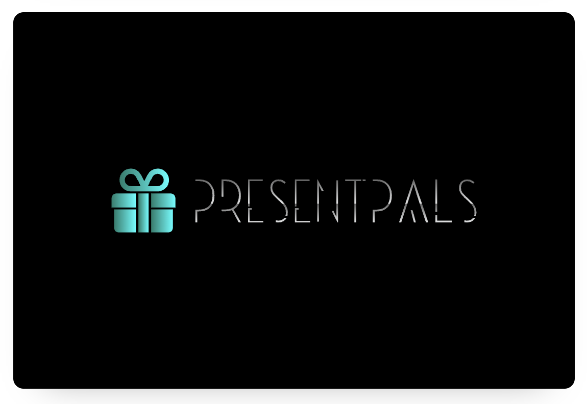

# R1 - PresentPals Description
---

# Purpose
Our customer's goal was to develop an application that is both meaningful and impactful, and we believe we've achieved the perfect balance. This initiative combines environmental sustainability with cost-efficiency and time-saving benefits, offering a solution that serves both the planet and the user. We focused on four key objectives: protecting the environment, minimizing wasteful spending on unwanted gifts, simplifying the gift-giving process, and saving time. Our aim was to create an experience that’s not only useful but also intuitive and enjoyable for all users.

## Functionalities/Features
 - Gift List
 - Customised profiles
 - Birthday or Event countdown
 - Invite Friends and Family
 - Shop by Brands - with Links to Popular Brands' websites

**insert example of wire frames image here for each feature**

 ## Target Audience
The platform was primarily designed with families in mind—particularly parents, grandparents, and other family members who want to make gift-giving easier and more meaningful. However, it’s also beneficial for groups beyond just families.

Parents and grandparents can create accounts, set up customized profiles for their children (ages 8-17), and start building personalized Wishlists. Once a wishlist is ready, the admin user (parent or grandparent) can easily share it with other family members, who can then purchase the perfect gift online directly through the provided links. It’s a simple, eco-friendly way to ensure the right gift is chosen, while saving time and reducing waste

## Key Objectives

**Environmental Impact:** 
By transitioning to a paperless system for gift lists, the platform helps significantly reduce paper waste. Traditional gift lists often require printing and can contribute to unnecessary consumption of paper, adding to landfill waste. By going digital, this system plays an active role in promoting environmental sustainability, minimizing the carbon footprint associated with producing, distributing, and discarding paper-based gift lists. In this way, it supports a more eco-friendly approach to gift giving, encouraging users to be mindful of their environmental impact.

**Cost-Effective Gift Giving:** 
The platform allows users to create personalised and precise gift lists tailored to each individual’s preferences, minimising the likelihood of purchasing unwanted, duplicate, or inappropriate gifts. By narrowing down the options, it helps families and groups avoid spending money on items that won't be appreciated, ultimately saving money and reducing waste. This cost-effective approach encourages thoughtful and practical gift-giving, ensuring that every purchase is meaningful, purposeful—both financially and budget friendly and environmentally.

**Streamlining the Gift Selection Process:**
The platform gathers valuable data on user preferences and interests, enabling gift-givers to choose presents that align with the recipient’s needs and desires. This eliminates the guesswork and uncertainty that often accompany traditional gift-giving. Moreover, by providing direct links for online purchases, users can swiftly and conveniently purchase the perfect gift without having to browse through endless stores or worry about choosing the wrong item or colour. The result is a faster, more efficient shopping experience that saves time and reduces stress, while ensuring that the gift is exactly what the recipient wants and will enjoy.

**Time Efficiency:**
The system will significantly improve the efficiency of the gift-giving process. By consolidating all the necessary information (such as preferences, ages, and wishlists, and where to purchase) into a single, easy-to-navigate platform, it reduces the time spent on planning and searching for gifts. Users can quickly view the gift options and select one that appeals to your budget and make their purchases online without needing to spend hours at shopping malls or browsing multiple websites. This not only saves time but also streamlines the entire experience for both the gift-giver and the recipient, making gift-giving more enjoyable and less time-consuming for everyone involved.

In summary, the project promotes sustainability, saves clients time and money, and offers a seamless shopping experience by linking users directly to online gift options. 

## Tech Stack

### Front-end
•	HTML
•	[JavaScript](https://www.javascript.com/)
•	CSS
•	[React](https://react.dev/)

### Back-end
•	[Express](https://expressjs.com/)
•	[Node.js](https://nodejs.org/en)

### Database
•	[MongoDB](https://www.mongodb.com/)
•	[Mongoose](https://mongoosejs.com/)

### Deployment
•	[Netlify](https://www.netlify.com/)
•	[Render](https://render.com/)

### Project Management Tools
•	[Discord](https://discord.com/)
•	[Trello](https://trello.com/)

### Testing
•	[Insomnia](https://insomnia.rest/)
•	[Postman](https://www.postman.com/)

### DevOps Tools
•	[git](https://git-scm.com/)
•	[GitHub](https://github.com/)
•	[Visual Studio Code](https://code.visualstudio.com/)

### Design Tools
•	[Figma](https://www.figma.com/)
•	[draw.io,diagrams.net](https://app.diagrams.net/)
