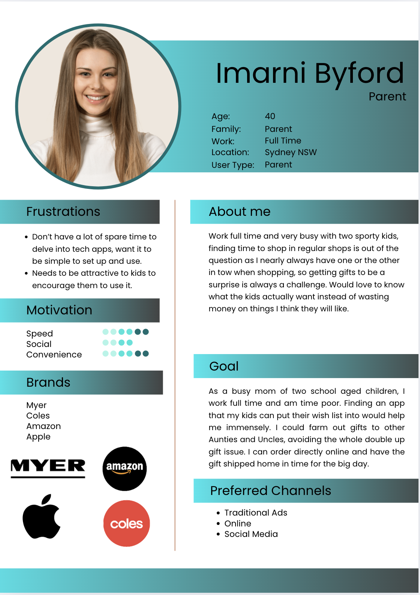
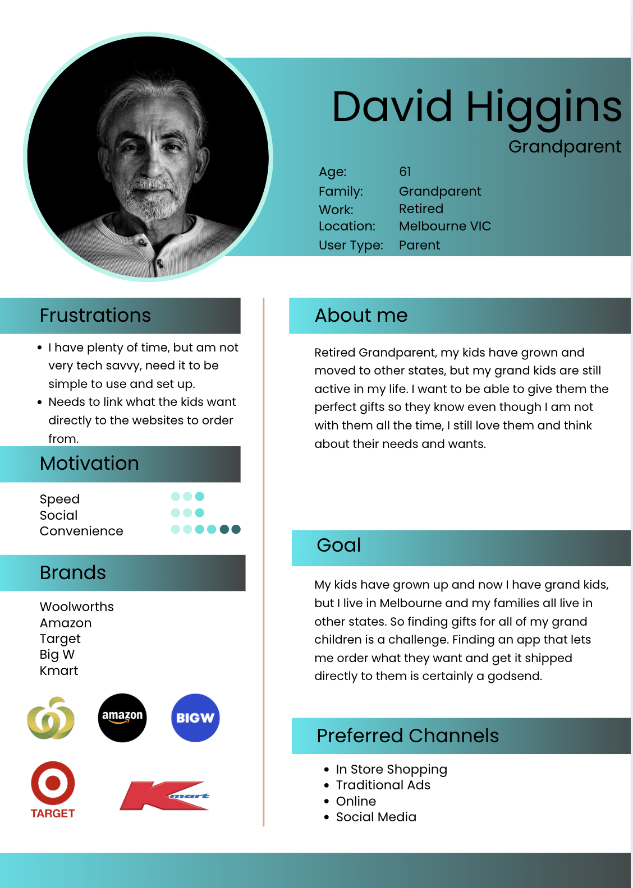
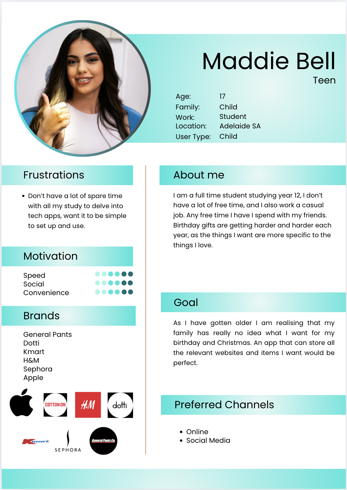
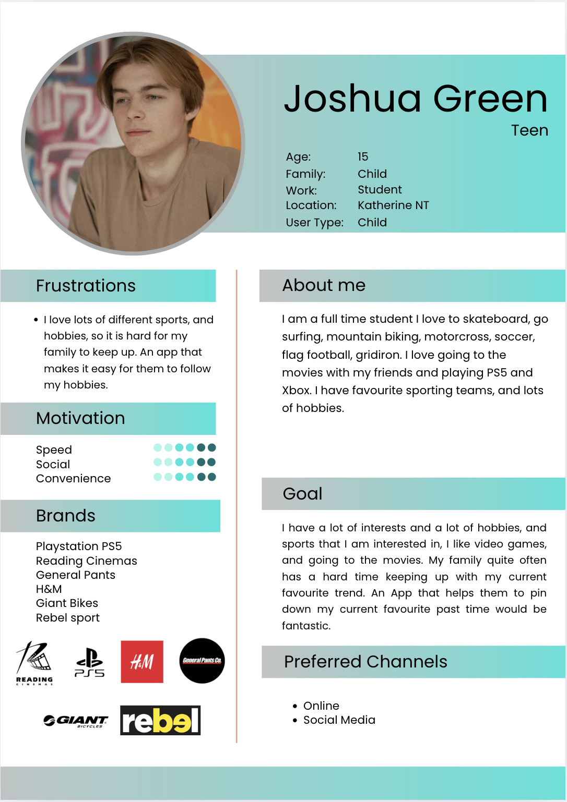
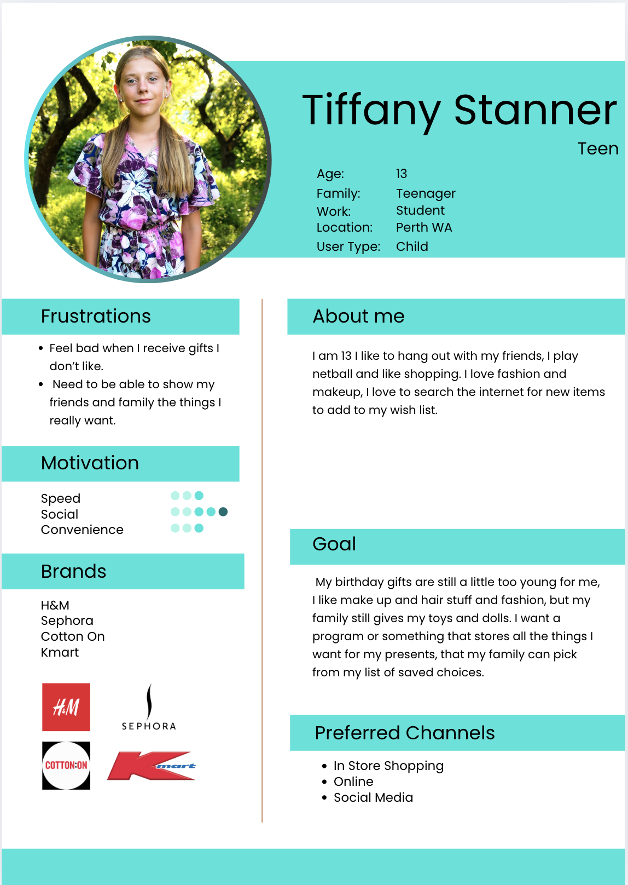
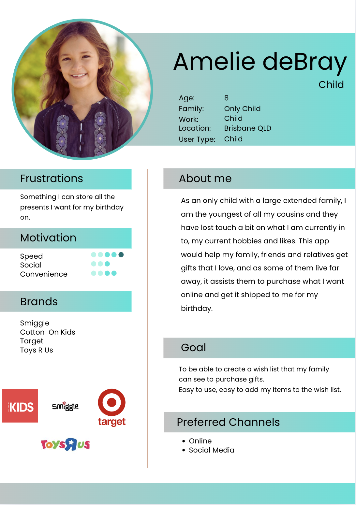

# R4 User Stories
In order to ensure that our application would meet the needs and expectations of our users, we made it a priority to gain a comprehensive understanding of what they truly wanted from the platform. To achieve this, we conducted in-depth interviews with a diverse range of individuals across various demographics. These discussions allowed us to gain valuable insights into their preferences, challenges, and the key benefits they would like to see incorporated into the application. By gathering this qualitative data, we were able to carefully define the structure and features of the platform, ensuring that it would not only address the specific needs of our users but also add meaningful value to their lives. This user-centered approach guided the design process, allowing us to create a solution that is both functional and truly impactful for those who use it.

### Parent/Grandparent
*   As a parent or grandparent, I want the ability to sign in and create individual profiles for my children or grandchildren, so I can easily manage their wishlists and personalise their gift preferences.

*   I want to view the products included in their wishlists and know exactly where to purchase them, ensuring a seamless shopping experience without the need for extensive searching.

*   I want to be able to forward the wishlist to other family members and friends, so they can select gifts from the list based on their preferences and what they wish to buy.

*   I need the ability to mark off items that have already been purchased and view which gifts have been chosen by others, to avoid duplication and ensure everyone knows which gifts are still available.

*   I want the platform to link directly to the websites where the products are sold, so users can conveniently purchase the items without needing to search across multiple online stores.

*   I need to be able to email the wishlist to other family members and assign them permissions, allowing them to sign up, view the list, and actively participate in the gift selection process.

### Child
*   I want the ability to create a personalised wishlist for occasions such as my birthday or Christmas, so I can easily organize and communicate my preferred gifts for these special events.

*   I want to have the flexibility to update and modify my wishlist by adding new items, adjusting existing ones, or removing gifts, ensuring that it accurately reflects my current preferences.

*   I would like to be able to input my birthday or Christmas date into the platform, so I can track a countdown to the occasion, enhancing my excitement and ensuring I never miss an important gift-giving milestone

### Family & Friends
•	Need to be emailed access, easy set up with granted permissions.
•	Need to have access to the wishlists to select items.
•	Need it to connect to the websites to purchase the items.

## PresentPals User Personas
To gain a deeper and more nuanced understanding of our target audience, we developed detailed User Personas. This approach enabled us to more effectively identify and analyse the goals, motivations, and specific needs of our users, ensuring that the application would be designed to meet their expectations and deliver a tailored, user-centric experience.

**Parent/Admin User**
*   Desires the ability to add their children as individual profiles within the app, allowing for personalised and easily managed wishlists for each child.

*   Wants to view the gifts that have been added to each child’s wishlist, ensuring full visibility of the items they have selected.

*   Wants the ability to share the wishlist with friends and family, enabling loved ones to view and select gifts directly from the list.

*   Wants friends and family to be able to select and purchase gifts directly from the wishlist, streamlining the gift-giving process and ensuring the right items are chosen.

*   Wants the ability to track which gifts have been selected by others, offering transparency and helping to avoid gift duplication.

*   Wants to maintain privacy for the children, ensuring that they are unable to see who has marked or purchased their gifts, preserving the surprise and excitement of gift-giving.

**Child/Created Profile User**
*   Desires to receive gifts that align with their preferences from friends and family, ensuring a thoughtful and meaningful gift-giving experience.

*   Wants the ability to add their preferred gift choices to their wishlist, allowing for easy organisation and communication of their desired items.

*   Wants the option to search for and select gifts from their favorite brands, providing more personalised and tailored gift options.

*   Wants the flexibility to add or remove items from their wishlist, enabling them to update their preferences as needed.

**Regular User**
*   Desires access to a standard navigation bar, ensuring a user-friendly and intuitive interface for easy navigation throughout the platform.

*   Wants a clear and comprehensive "About" page, offering users a concise overview of the platform’s purpose, features, and benefits.

*   Wants the ability to create a personalised account and securely log in, providing a customized experience with easy access to their preferences and account settings.

*   Wants the option to add friends and family members to their account, enabling seamless interaction and collaboration within the platform.

**Logged in User Admin**
*   Desires the ability to create a personalised wishlist, enabling them to curate a selection of preferred gifts tailored to their individual tastes and needs.

*   Wants to track the gifts they desire, ensuring they have an organised list of preferred items for various occasions.

*   Wants the option to mark items as purchased, allowing for easy management of the wishlist and preventing duplicate purchases.

*   Wants the ability to add gifts to their wishlist from external websites, providing greater flexibility in curating a comprehensive selection of desired products.