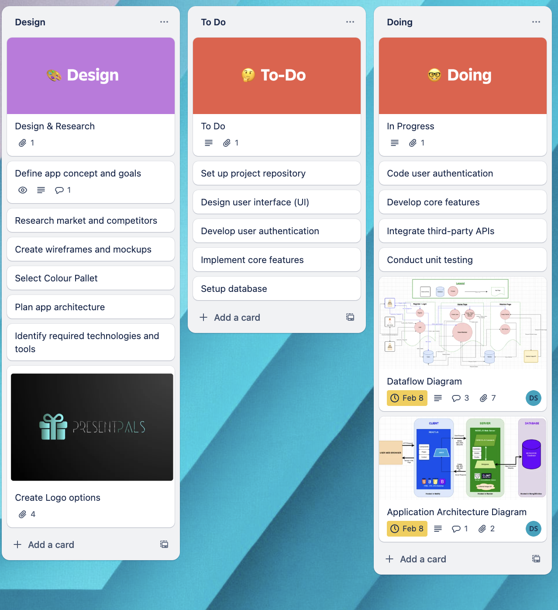

# T3A2 Part A Documentation
# PresentPals
# R6. Project Management

## Trello Board
#### Trello Board Implementation for Streamlined Project Management

In order to optimise our planning methodology, we strategically selected Trello as our project management tool and implemented the Kanban approach due to its inherent flexibility and capacity to enhance workflow efficiency. The Kanban method is widely recognised for its visual task management systems, which enabled us to maintain a continuous flow of work while minimizing bottlenecks and disruptions throughout the project lifecycle.

By utilising Trello’s digital Kanban board, we provided all team members with a clear and transparent view of tasks at any given time. This transparency not only helped us to prioritise our work effectively but also ensured accountability, as each task’s status could be easily tracked and updated with the progression of the task. The visual layout of Trello’s board empowered the team to make real-time adjustments and pivot quickly as the project evolved, responding to changes or unforeseen challenges with ease and efficiency.

The flexibility of Trello allowed us to configure the board to suit the specific needs of our project which enabled us a custom workflow that supported optimal efficiency and productivity. Additionally, the integration of automation features within Trello further facilitated task management, ensuring that repetitive actions were streamlined, and time spent on administrative tasks was minimised. This setup structure significantly contributed to our ability to support continuous delivery, consistent compliance with deadlines and assisted in maintaining a high standard of quality for our outputs.

Ultimately, the combination of the Kanban approach with Trello’s digital platform created an organised, adaptable, and highly effective task management system that empowered our team to remain on track, and focused, and aligned our productiveness from start to finish for each task.

